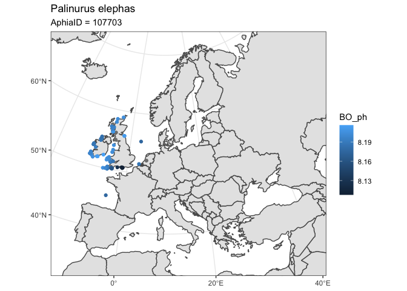

<!-- README.md is generated from README.Rmd. Please edit that file -->

# OBIShmpr

<!-- badges: start -->

[](https://www.tidyverse.org/lifecycle/#experimental)
[](https://github.com/EMODnet/OBIShmpr/actions)
[](https://codecov.io/gh/EMODnet/OBIShmpr?branch=master)
<!-- badges: end -->

The goal of OBIShmpr is to link and query OBIS occurence data with a
variety of marine habitat data.

### Data Sources

  - #### [**Bio-ORACLE**](https://www.bio-oracle.org/) & [**MARSPEC**](http://www.marspec.org/) data accesed through `sdmpredictors`:
    
    a set of GIS rasters providing geophysical, biotic and environmental
    data for surface and benthic marine realms. Accessed via
    [`sdmpredictors`](https://github.com/lifewatch/sdmpredictors)

  - #### `sedmaps` [Synthetic map of the NW European Shelf sedimentary environment](https://www.earth-syst-sci-data.net/10/109/2018/essd-10-109-2018.pdf)
    
    **data product**
    [10.15129/1e27b806-1eae-494d-83b5-a5f4792c46fc](https://pureportal.strath.ac.uk/en/datasets/data-for-a-synthetic-map-of-the-northwest-european-shelf-sediment)
    0.125◦ by 0.125◦ resolution synthetic maps of continuous properties
    of the north-west European sedimentary environment. The maps are a
    blend of gridded survey data, statistically modelled values based on
    distributions of bed shear stress due to tidal currents and waves
    and bathymetric properties.
    
      - percentage compositions of mud, sand and gravel;
      - porosity and permeability;
      - median grain size of the whole sediment and of the sand and the
        gravel fractions;
      - carbon and nitrogen content of sediments;
      - percentage of seabed area covered by rock;
      - mean and maximum depth-averaged tidal velocity and wave orbital
        velocity at the seabed; and mean monthly natural disturbance
        rates.

  - #### [EMODnet Seabed Habitat maps]()

## Installation

You can install the development version from
[GitHub](https://github.com/) with:

``` r
# install.packages("remotes")
remotes::install_github("EMODnet/OBIShmpr")
```

## Example

### Get habitat data for a species

``` r
library(OBIShmpr)
```

## An example with one species

This is an example of how to run the above code for a single species -
we use *Scytothamnus fasciculatus*, Aphia ID 325567, chosen as it has
just 6 OBIS records so should run reasonably quickly.

Choose some layers to extract data from

``` r
sp_id <- 325567
layers <- c("BO2_nitratemax_bdmin", "BO_parmax", "BO2_tempmax_bdmax", "permeability", 
"tidal_vel_max", "april")
```

``` r
obis_match_habitat(sp_id, layers = layers)
#> Simple feature collection with 6 features and 16 fields
#> geometry type:  POINT
#> dimension:      XY
#> bbox:           xmin: -65 ymin: -48.65 xmax: 173.7005 ymax: -40.7
#> CRS:            EPSG:4326
#> # A tibble: 6 x 17
#>   scientificName aphiaID maximumDepthInM… id    minimumDepthInM… eventDate depth
#>   <chr>            <int> <lgl>            <chr> <lgl>            <chr>     <dbl>
#> 1 Scytothamnus …  325567 NA               025d… NA               <NA>         NA
#> 2 Scytothamnus …  325567 NA               0d31… NA               <NA>         NA
#> 3 Scytothamnus …  325567 NA               4c2c… NA               <NA>         NA
#> 4 Scytothamnus …  325567 NA               5a38… NA               1945/09/…    NA
#> 5 Scytothamnus …  325567 NA               974d… NA               <NA>         NA
#> 6 Scytothamnus …  325567 NA               cdbb… NA               <NA>         NA
#> # … with 10 more variables: year <chr>, month <chr>, depth0 <dbl>,
#> #   geometry <POINT [°]>, BO2_nitratemax_bdmin <dbl>, BO_parmax <dbl>,
#> #   BO2_tempmax_bdmax <dbl>, permeability <lgl>, tidal_vel_max <lgl>,
#> #   april <lgl>
```

``` r
layer_codes <- c("BO_ph", "BO_phosphate", 
                 "BO2_phosphatemean_bdmax", 
                 "BO_nitrate", "BO2_nitratemean_bdmax", 
                 "surface_nitrogen", "tn", "surface_carbon",
                 "BO_sstmean", "BO_sstmin", "BO_sstmax", 
                 "MS_biogeo13_sst_mean_5m", "MS_biogeo14_sst_min_5m",
                 "MS_biogeo15_sst_max_5m")
```

### *Palinurus elephas*

Next I use the AphiaID for *Palinurus elephas*.

``` r
species_id <- worrms::wm_name2id("Palinurus elephas")

data <- OBIShmpr::obis_match_habitat(
    sp_id = species_id, 
    layers = layer_codes,
    geometry = bbox_nwes)
#> Retrieved 96 records of approximately 96 (100%)✓ `obis_recs` successfully converted to sf
#> ✓ `obis_recs` crs: EPSG:4326, GEOGCS["WGS 84",
#>       DATUM["WGS_1984",
#>           SPHEROID["WGS 84",6378137,298.257223563,
#>               AUTHORITY["EPSG","7030"]],
#>           AUTHORITY["EPSG","6326"]],
#>       PRIMEM["Greenwich",0,
#>           AUTHORITY["EPSG","8901"]],
#>       UNIT["degree",0.0174532925199433,
#>           AUTHORITY["EPSG","9122"]],
#>       AUTHORITY["EPSG","4326"]]
#> ✓ `obis_recs` crs: EPSG:4326, GEOGCS["WGS 84",
#>       DATUM["WGS_1984",
#>           SPHEROID["WGS 84",6378137,298.257223563,
#>               AUTHORITY["EPSG","7030"]],
#>           AUTHORITY["EPSG","6326"]],
#>       PRIMEM["Greenwich",0,
#>           AUTHORITY["EPSG","8901"]],
#>       UNIT["degree",0.0174532925199433,
#>           AUTHORITY["EPSG","9122"]],
#>       AUTHORITY["EPSG","4326"]]

data
#> Simple feature collection with 96 features and 24 fields
#> geometry type:  POINT
#> dimension:      XY
#> bbox:           xmin: -10.60808 ymin: 45.59042 xmax: 4.95983 ymax: 58.92086
#> CRS:            EPSG:4326
#> # A tibble: 96 x 25
#>    month year  scientificName aphiaID maximumDepthInM… id    eventDate
#>    <chr> <chr> <chr>            <int>            <dbl> <chr> <chr>    
#>  1 10    1982  Palinurus ele…  107703               NA 01c3… 1982-10-…
#>  2 04    2003  Palinurus ele…  107703               NA 01d3… 2003-04-…
#>  3 08    2009  Palinurus ele…  107703               NA 0227… 2009-08-…
#>  4 06    2009  Palinurus ele…  107703               NA 0704… 2009-06-…
#>  5 09    2009  Palinurus ele…  107703               NA 0a2e… 2009-09-…
#>  6 08    1978  Palinurus ele…  107703               NA 0afa… 1978-08-…
#>  7 07    1977  Palinurus ele…  107703               NA 0b1b… 1977-07-…
#>  8 08    2010  Palinurus ele…  107703               NA 0d72… 2010-08-…
#>  9 08    2009  Palinurus ele…  107703               NA 0dbe… 2009-08-…
#> 10 07    2009  Palinurus ele…  107703               NA 0e17… 2009-07-…
#> # … with 86 more rows, and 18 more variables: minimumDepthInMeters <int>,
#> #   depth <dbl>, depth0 <dbl>, geometry <POINT [°]>, BO_ph <dbl>,
#> #   BO_phosphate <dbl>, BO2_phosphatemean_bdmax <dbl>, BO_nitrate <dbl>,
#> #   BO2_nitratemean_bdmax <dbl>, surface_nitrogen <dbl>, tn <dbl>,
#> #   surface_carbon <dbl>, BO_sstmean <dbl>, BO_sstmin <dbl>, BO_sstmax <dbl>,
#> #   MS_biogeo13_sst_mean_5m <dbl>, MS_biogeo14_sst_min_5m <dbl>,
#> #   MS_biogeo15_sst_max_5m <dbl>
```

``` r
library(ggplot2)
world <- rnaturalearth::ne_countries(scale = "medium", returnclass = "sf")


ggplot() +
    geom_sf(data = world) +
    geom_sf(data = data, aes(color = BO_ph) ) +
    coord_sf(crs = 3035,
             xlim = c(2426378.0132, 7093974.6215),
             ylim = c(1308101.2618, 5446513.5222)) +
    theme_bw() +
    ggtitle("Palinurus elephas",
            subtitle = paste0('AphiaID = ', species_id))
```


